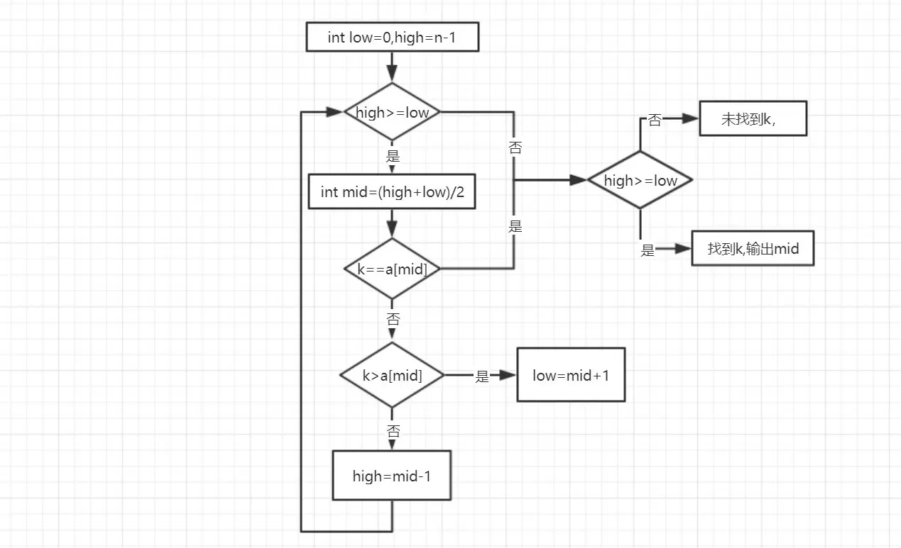
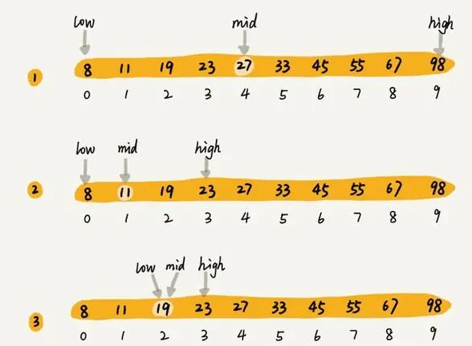

# 二分查找算法详解
## 1. 定义
   
二分查找又称*折半查找*，它是一种效率较高的查找方法。

>二分查找要求：线性表是**有序表**，即表中**结点按关键字有序**，并且**要用向量作为表的存储结构**。不妨设有序表是递增有序的。

## 2. 基本思想
   
在一个有序数组中查找一个元素target，将target和数组中间位置的元素比较
1. 如果target和中间元素相等，则查找成功
2. 如果target较小，就将查找范围缩小到左半部分，继续循环
3. 如果target较大，就将查找范围缩小到右半部分，继续循环

算法流程图如下所示：


## 3. 实现代码
- C++实现

```c++

int searchInsert(vector<int>& nums, int target) {
    int l =0;
    int r = nums.size() - 1;
    while(l <= r) {
        int mid = l + (r - l) / 2;
        if(nums[mid] == target) {
            return mid;
        }else if(nums[mid] > target){
            r = mid -1;
        }else{
            l = mid + 1;
        }
    }
    return l;
}

```
- Python实现

```python
def bin_search(data_list, val):    
    low = 0                         
    high = len(data_list) - 1      
    while low <= high:        
        mid = (low + high) // 2     
        if data_list[mid] == val:   # 如果中间数下标等于val, 返回            
            return mid        
        elif data_list[mid] > val:  # 如果val在中间数左边, 移动high下标            
            high = mid - 1        
        else:                       # 如果val在中间数右边, 移动low下标            
            low = mid + 1    
    return # val不存在, 返回None
ret = bin_search(list(range(1, 10)), 3)
print(ret)
```

- 示例
>输入表中的数据元素：8 11 19 23 27 33 45 55 67 98,输入查找数据的关键字：19,则数据在查找表中的位置为：3




## 4. 算法分析
折半查找的时间效率为**O(log2n)**

虽然折半查找的效率高，但是要将表按关键字排序。而排序本身是一种很费时的运算，所以二分法比较适用于顺序存储结构。为保持表的有序性，在顺序结构中插入和删除都必须移动大量的结点。

因此，折半查找特别适用于那种一经建立就很少改动而又经常需要查找的线性表。

## 5.参考资料

1. [二分查找（折半查找）](https://www.jianshu.com/p/6e459af988ef)
2. [算法总结-二分查找法](https://zhuanlan.zhihu.com/p/80814657)