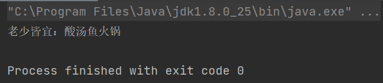

# 基于工厂模式的简单火锅订单系统（Java实现）

## 含义
工厂模式（Factory Pattern）是 Java 中最常用的设计模式之一。这种类型的设计模式属于创建型模式，它提供了一种创建对象的最佳方式。在工厂模式中，我们在创建对象时不会对客户端暴露创建逻辑，并且是通过使用一个共同的接口来指向新创建的对象。

在一些情况下，要创建的对象需要一系列复杂的初始化操作，比如查配置文件、查数据库表、初始化成员对象等，如果把这些逻辑放在构造函数中，会极大影响代码的可读性。不妨定义一个类来专门负责对象的创建，这样的类就是工厂类，这种做法就是工厂模式，在任何需要生成复杂对象的地方，都可以使用工厂模式。

## JAVA实现工厂模式的火锅订单系统
```java
//火锅类
public abstract class HotPot {
    abstract String getName();
}
//锅底1类
public class PotType1 extends HotPot {
    @Override
    String getName() {
        return "爱辣者首选：麻辣羊肉火锅";
    }
}
//锅底2类
public class PotType2 extends HotPot {
    @Override
    String getName() {
        return "清爽正宗：清汤潮汕牛肉火锅";
    }
}
//锅底3类
public class PotType3 extends HotPot {
    @Override
    String getName() {
        return "聚餐首选：鸳鸯锅";
    }
}
//锅底4类
public class PotType4 extends HotPot {
    @Override
    String getName() {
        return "老少皆宜：酸汤鱼火锅";
    }
}
//火锅店类
public class HotPotShop {
    public HotPot ChooseHot(String type) {
        HotPot hotPot = null;
        if (type.equals("麻辣羊肉火锅")) {
            hotPot = new PotType1();
        } else if (type.equals("潮汕牛肉火锅")) {
            hotPot = new PotType2();
        } else if (type.equals("鸳鸯锅")) {
            hotPot = new PotType3();
        }else if (type.equals("酸汤鱼火锅")) {
            hotPot = new PotType4();
        } else {
            throw new RuntimeException("没有该锅底");
        }

        return hotPot;
    }
}
//订购类
public class OrderSystem {
    public static void main(String[] args) {
        HotPotShop hotPotShop = new HotPotShop();
        HotPot hotPot = hotPotShop.ChooseHot("酸汤鱼火锅");
        System.out.println(hotPot.getName());
    }
}

```

## 运行示例



## 引用
（1）. [工厂模式详解](https://blog.csdn.net/qq_31960623/article/details/117198355)